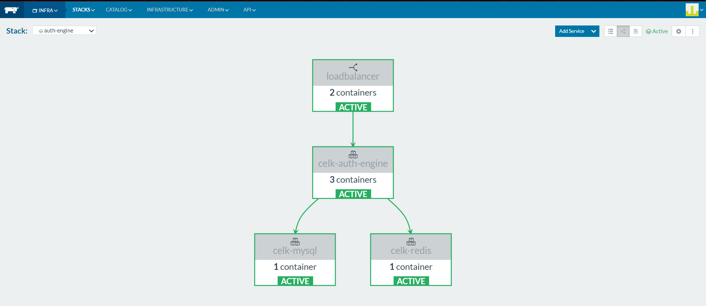

# Celk-Auth-Engine
> A ideia desta api é ser motor de autenticação de diversas APIs num eco systema de microserviços.

# Requisitos

- [x] Escolha as tecnologias (java, go ou C#) - **_JAVA_**
- [x] Cache - **_REDIS_**
- [ ] Mensageria - **_Conforme alinhado com Zini não faz sentido neste contexto._**
- [ ] GraphQL - **_Não utilizado por não dominar totalmente e o prazo ser curto._**
- [x] Documentação da API - **_SPRING FOX_**

- [x] Maior robustez possível - **_Utilizamos docker sendo possível escalar a aplicação horizontalmente_**
 - [x] Tempo de resposta abaixo de 50ms - **_Embora nos testes feitos obter o token leva pouco acima de 50ms. A validação do token atende totalmente o requisito_**
 - [ ] Apresentar um teste de carga com x requisições por segundo e y threds - **_Foi feito testes com postman. Devido ao tempo não foi possível cenario ambiente com JMETER._**

- [x] Apresente um esquema usando uma ferramenta que tenha domínio. Sugestão do Draw.io. **_investi tempo no read-me para documentar_**


#Tecnologias
- Java - 1.8_201
- Springboot - 2.0.4.RELEASE
- Spring Security - Implementação da autenticação Oauth 2.
- Flyway - Criar estrutura e popular a base.
- Redis - Armazenar tokens gerados e dados de autenticação.
- Spring fox - Gerar Swagger.
- Docker 19.03.4 - Porque docker é vida!!! 
- Rancher - 1.6 - facilitar orquestração e automização do docker.
- Ha proxy - Load balancer para facilitar A/B e distribuir carga se necenssario.

# Arquitetura com flow Oauth 2.0

Nossa aplicação segue o [ouath 2](https://oauth.net/2/):


 
 Conforme podemos ver neste imagem um usuário entre com usuário e senha em uma aplicação cliente **ex: Mobile**.
 
 A **aplicação cliente** previamente autorizada solicita um token ao motor de autorização **Servidor de autorização (nossa api)**.
 
 Através do endereço: http://localhost:8080/oauth/token obtem o **access_token**.
 
 Com acess_token a **Aplicação Client** pode acessar os recursos protegidos dos demais microserviços.
  
 Para facilitar nosso case nossa apicação efetua o papel de **Servidor de autorização** e **Resource server** simulando os demais microserviços através do método http://localhost:8080/api/auth-engine/v1/validate?access_token=6f714cc3-d3c5-4ff9-a61b-5f3c8239f2de onde retorna 200 Ok, caso as credenciais passadas façam sentido.
 
 # Arquitetura de infraestrutura
 Para garantir que alta disponibilidade e deploy fosse facilitado utilizamos  [docker](https://www.docker.com/) e [rancher](https://rancher.com/).
 
 

Conforme podemos ver montamos uma infraestrutura com **loadbalancer(HA proxy)** scale =2.
 
**Motor de autenticação** com scale=3 podendo ser escalada horizontalmente quanto quisermos.
 
**mysql e redis** não escalamos por não necessitar de for exaustiva porém é facilmente escavel.

Num cenário mais crítico podemos utilizar rancher e criar autoscale de container e máquinas de forma automatizada.

Facilmente podemos escrever um catalog no rancher sendo possivel montar toda infraestrutura com apenas 2 cliques. **"Diretorio do Projeto/docker/rancher"** tem os arquivos docker-compose.yml e rancher-compose.yml que é possível subir a aplicação em segundos.

**_Obs: localmente optei por automatizar a subida do projeto com docker-compose.yml sem rancher para facilitar a execução._**
 
#TO DO
Projeto foi concebido em torno de 10 horas. O que deixou diversos GAPS técnicos na solução, porém acredito que ela atenda os requisítos que o desafio exigia.

Portanto alguns TO DO estão espalhados pelo código, coisas que poderiam ser facilmente resolvidos porém devido a foco no timebox e requisitos acordados ficaram pendentes como diz famoso engenheiro da linkedin
 **_"Se você fez um código onde não se envergonha de absolutamente nada, provavelmente levou mais tempo do que deveria"_**.
 
 ###Pontos passiveis de melhoria
 - Criar um microserviço separado para validar o token gerado.
 - Criar duas lib para validar o token e efetuar requisições.
 - Customizar e tratar as exception de forma mais adequada.
 - Implementar JWT.
 - Configurações de ClientDetailsServiceConfigurer poderiam ser recuperadas do banco.
 - Retornar no token configurações de role e permitions retornada do Banco de dados.
 - Automatizar autoscaling rancher.
 - Instalar graylog para termos um log centralizado dos microserviços.
 - Instalar servidor de configuração para facilitar a manutenabilidade do sistema.
 - Teste carga com JMETER.
 - Teste de unitário.
  
## Execução do projeto
Pré-requisito para execução é estar com docker instalado.

**docker-compose**
```sh
cd docker

C:\Users\diegon\IdeaProjects\poc\celk-auth-engine\docker>docker-compose up
Starting celk-mysql ... done
Starting celk-redis ... done
Starting celk-auth-engine ... done
```
Rancher:

Importar para dentro da stack os arquivos contidos na pasta docker/rancher e dar play.

## Testando a aplicação

Para efetuar o teste da aplicação baixar o [postman](https://www.postman.com/) e importar o arquivo docs/auth-celk.postman_collection.json.

Executar o metodo /oauth/token com objetivo de pegar um token


É necessar fornecer credencias para obter token o Aplicação cliente precisa ser confiavel Username e Password.
 


Agora que passamos as credencias precisamos identificar o cliente informando username, Password e grant_type conforme a imagem acima.


Caso as credenciais sejam válidas nosso motor devolve o *access_token*, *token_type*, *refresh_token*, *expires_in* e *scope*.

**OBS: Nos testes executados o serviço que gera os token leva em torno 120ms.**


Com access_token utilizamos como parametro no momento de autenticar para chamar o serviço de validação.
Se o token for correto a api retornará 200 OK.

#### API Docs


#### API Swagger


#### Redis 


### Tabelas populadas pelo flyway-USER


### Tabelas populadas pelo flyway-ROLE


## Meta

Diego Caibaté – [Linkedin](https://www.linkedin.com/in/diego-caibat%C3%A9-3536901a/) – YourEmail@example.com

[https://github.com/caibate/celk-auth-engine](https://github.com/caibate/celk-auth-engine)
